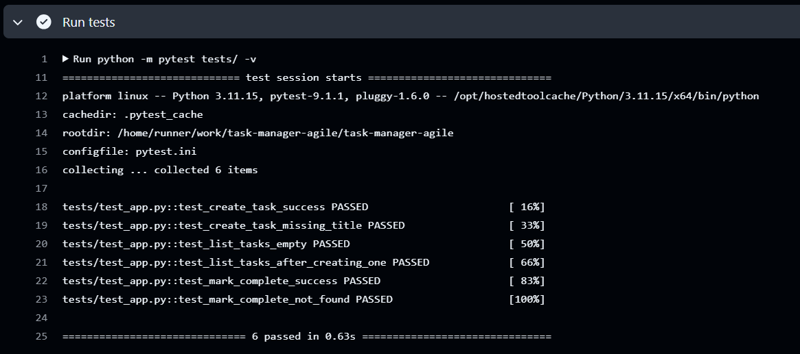

# Sprint 1 Review

## Sprint Goal
Deliver a working add → view → complete task flow, with automated testing and a CI pipeline in place.

## Backlog Items Delivered

| Story | Status | Points |
|---|---|---|
| US1 — Add a new task | ✅ Done | 3 |
| US2 — View all tasks | ✅ Done | 2 |
| US3 — Mark a task complete | ✅ Done | 2 |

**Total delivered: 7 / 7 planned points**

## Demo Evidence

### US1 — Add a task
Request:
```
POST /tasks
Body: {"title": "Buy milk"}
```
Response (201 Created):
```json
{
  "completed": false,
  "id": 1,
  "title": "Buy milk"
}
```

Error case — missing title (400 Bad Request):
```json
{
  "error": "title is required"
}
```

### US2 — View all tasks
Request:
```
GET /tasks
```
Response (200 OK):
```json
[
  {
    "completed": false,
    "id": 1,
    "title": "Buy milk"
  }
]
```
Empty state also verified: returns `[]` with 200 OK when no tasks exist, not an error.

### US3 — Mark a task complete
Request:
```
PATCH /tasks/1/complete
```
Response (200 OK):
```json
{
  "message": "Task marked as complete"
}
```
Confirmed via follow-up GET /tasks that `completed` persisted as `true`.

Error case — non-existent task ID (404 Not Found):
```json
{
  "error": "Task not found"
}
```

## Acceptance Criteria Check

All acceptance criteria defined in Sprint 0 for US1, US2, and US3 were met:
- Valid input produces correct success responses with correct HTTP status codes (201, 200)
- Invalid input produces correct error responses with correct HTTP status codes (400, 404)
- Data persists correctly between requests (verified via follow-up GET calls)

## Automated Testing

6 automated tests written using pytest, covering both success and failure paths for every endpoint:

```
tests/test_app.py::test_create_task_success PASSED
tests/test_app.py::test_create_task_missing_title PASSED
tests/test_app.py::test_list_tasks_empty PASSED
tests/test_app.py::test_list_tasks_after_creating_one PASSED
tests/test_app.py::test_mark_complete_success PASSED
tests/test_app.py::test_mark_complete_not_found PASSED

6 passed in 0.63s
```

Tests run against an isolated test database (via pytest fixture + monkeypatch), ensuring no shared state between tests or with the development database.

## CI/CD Pipeline

GitHub Actions workflow (`.github/workflows/ci.yml`) runs automatically on every push to `master`:
1. Checkout code
2. Set up Python 3.11
3. Install dependencies from `requirements.txt`
4. Run full pytest suite

First pipeline run: ✅ passed in 10s, all 6 tests green on a clean Ubuntu runner (independent of local machine).


## Commit History

17 commits, each scoped to a single logical change (one function, one endpoint, or one test group per commit), with descriptive messages tying each commit back to its user story (e.g. "Add POST /tasks endpoint to create a task (US1)").

## Definition of Done — Status

| DoD Item | Met? |
|---|---|
| Committed with clear messages | ✅ |
| Small, incremental commits | ✅ |
| Automated test coverage | ✅ |
| CI pipeline passes | ✅ |
| Matches Acceptance Criteria | ✅ |
| No hardcoded/broken values | ✅ |

Sprint 1 backlog items (US1, US2, US3) are considered fully Done.
```