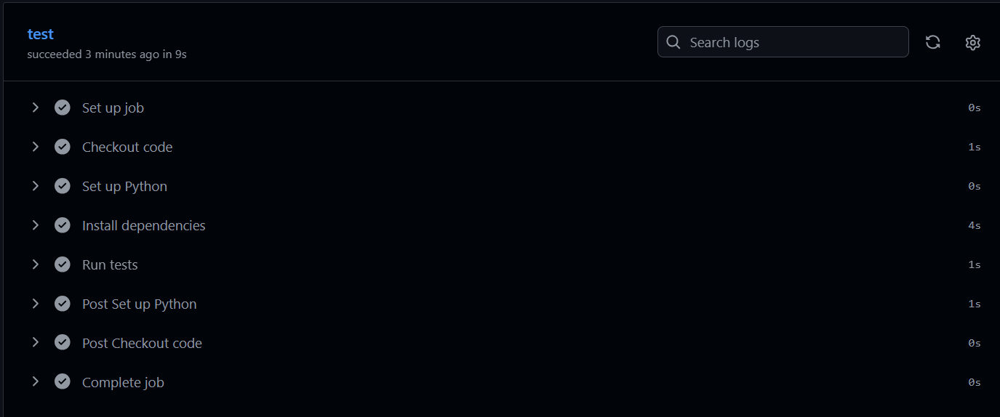

## `SPRINT2_REVIEW.md`

```markdown
# Sprint 2 Review

## Sprint Goal
Complete the remaining backlog (delete task, health check), add basic monitoring/logging, and apply improvements identified in the Sprint 1 Retrospective.

## Backlog Items Delivered

| Story | Status | Points |
|---|---|---|
| US4 — Delete a task | ✅ Done | 2 |
| US5 — Health check endpoint | ✅ Done | 1 |

**Total delivered: 3 / 3 planned points**
**Full backlog complete: 10 / 10 points across both sprints**

## Demo Evidence

### US4 — Delete a task
Request:
```
DELETE /tasks/1
```
Response (200 OK):
```json
{
  "message": "task deleted"
}
```
Confirmed via follow-up GET /tasks that the task no longer appears in the list.

Error case — non-existent task ID (404 Not Found):
```json
{
  "error": "task not found"
}
```

### US5 — Health check
Request:
```
GET /health
```
Response (200 OK):
```json
{
  "status": "ok"
}
```

## Monitoring & Logging

Added structured logging (Python's built-in `logging` module) across all task-modifying endpoints:
- `INFO` level logs for successful actions (task created, marked complete, deleted), including relevant details (task ID, title)
- `WARNING` level logs for expected failure cases (missing title, task not found), distinguishing routine bad input from genuine system errors

Sample log output from manual testing:
```
2026-07-04 12:33:11,113 [INFO] Task created: id=2, title=Log test task
2026-07-04 12:33:21,300 [WARNING] Task creation failed: missing title
2026-07-04 12:34:45,140 [INFO] Task marked complete: id=2
2026-07-04 12:35:23,532 [INFO] Task deleted: id=2
2026-07-04 12:35:34,728 [WARNING] Delete failed: task 999 not found
```

## Automated Testing

3 additional automated tests added this sprint (2 for US4, 1 for US5), bringing the total to 9 passing tests covering all 5 backlog items:

```
tests/test_app.py::test_create_task_success PASSED
tests/test_app.py::test_create_task_missing_title PASSED
tests/test_app.py::test_list_tasks_empty PASSED
tests/test_app.py::test_list_tasks_after_creating_one PASSED
tests/test_app.py::test_mark_complete_success PASSED
tests/test_app.py::test_mark_complete_not_found PASSED
tests/test_app.py::test_delete_task_success PASSED
tests/test_app.py::test_delete_task_not_found PASSED
tests/test_app.py::test_health_check PASSED

9 passed
```

## Retrospective Improvements Applied

All 3 improvements identified in the Sprint 1 Retrospective were applied this sprint:

1. **Documented planning before implementation** — the Sprint 2 plan was added to `README.md` and committed before any Sprint 2 code was written.
2. **Reviewed `git status` before staging** — practiced throughout Sprint 2 to avoid accidental/stray file commits.
3. **Upgraded CI dependency versions** — `actions/checkout` upgraded to v5 and `actions/setup-python` upgraded to v6, fully resolving the Node.js deprecation warning present since Sprint 1 (verified via a clean CI run with zero warnings).

## CI/CD Pipeline

All Sprint 2 commits continued to trigger the GitHub Actions pipeline automatically, with all 9 tests passing on every push, including after the dependency version upgrades.



## Definition of Done — Status

| DoD Item | Met? |
|---|---|
| Committed with clear messages | ✅ |
| Small, incremental commits | ✅ |
| Automated test coverage | ✅ |
| CI pipeline passes | ✅ |
| Matches Acceptance Criteria | ✅ |
| No hardcoded/broken values | ✅ |

Sprint 2 backlog items (US4, US5) are fully Done. All 5 user stories across both sprints are complete.
```